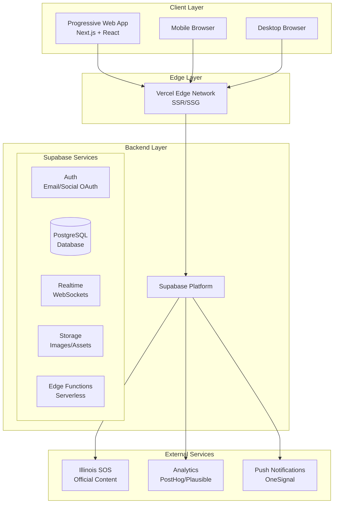
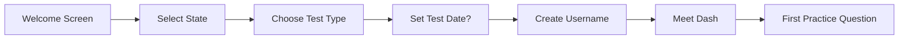
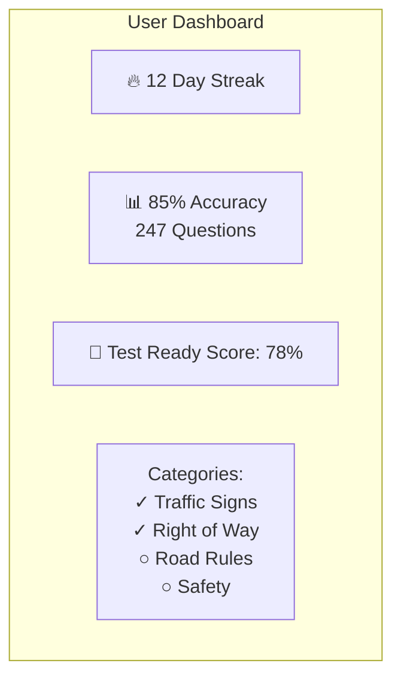

# DriveMaster - Illinois Driving Test Study App
## Comprehensive Technical Architecture & Design Document

**Version:** 1.0  
**Date:** January 2026  
**Status:** Draft  

---

## Table of Contents

1. [Executive Summary](#1-executive-summary)
2. [App Name & Branding Concept](#2-app-name--branding-concept)
3. [Feature Research & Analysis](#3-feature-research--analysis)
4. [Technical Architecture](#4-technical-architecture)
5. [Core Features Specification](#5-core-features-specification)
6. [Illinois DMV Content Strategy](#6-illinois-dmv-content-strategy)
7. [Implementation Roadmap](#7-implementation-roadmap)

---

## 1. Executive Summary

DriveMaster is a mobile-first web application designed to help Illinois residents prepare for their driving permit and license tests. Inspired by Duolingo's engaging gamification mechanics, the app transforms the traditionally dry experience of studying DMV materials into an interactive, rewarding journey.

### Key Objectives
- **Primary:** Help users pass the Illinois DMV written test on their first attempt
- **Secondary:** Create an engaging, habit-forming study experience through gamification
- **Tertiary:** Build a community of learners through leaderboards and social features

### Target Audience
- First-time drivers (ages 15-18)
- Adults seeking their first license
- International drivers converting to Illinois licenses
- Anyone needing to renew or retake their written exam

---

## 2. App Name & Branding Concept

### 2.1 App Name Options

After careful consideration of market positioning, memorability, and domain availability, we recommend the following options:

#### **Option 1: DriveMaster** (Recommended)
- **Rationale:** Combines "Drive" with "Master," implying expertise and achievement. The name is professional yet approachable, suggesting the user will become a master of driving knowledge.
- **Pros:** Easy to remember, conveys competence, works well for all demographics
- **Cons:** Common word combination may have trademark considerations

#### **Option 2: PermitPal**
- **Rationale:** Friendly, approachable name that positions the app as a companion/helper. The alliteration makes it memorable.
- **Pros:** Warm, friendly tone; clearly communicates purpose
- **Cons:** May feel too juvenile for adult learners

#### **Option 3: LicenseLab**
- **Rationale:** Suggests a scientific, methodical approach to learning. Appeals to users who want a structured study experience.
- **Pros:** Professional, implies thoroughness and testing
- **Cons:** Less emotionally engaging; "Lab" might feel clinical

#### **Option 4: RoadReady**
- **Rationale:** Directly addresses the end goal - being ready for the road. Action-oriented and motivating.
- **Pros:** Clear value proposition, motivational
- **Cons:** Somewhat generic; may be harder to trademark

#### **Option 5: TestTrack**
- **Rationale:** Combines testing with the concept of a race track, suggesting speed and progress.
- **Pros:** Dynamic, suggests quick progress
- **Cons:** May imply racing, which could be negative for safety-focused content

### 2.2 Mascot/Character Design Concept

**Character Name:** "Dash"

**Concept:** A friendly, animated car character with personality traits inspired by successful app mascots like Duolingo's Owl.

**Visual Design:**
- **Appearance:** Cute, compact car with expressive headlights for eyes and a bumper that forms a smile
- **Color:** Primary brand blue with accent colors that change based on user achievements
- **Personality:** Encouraging, slightly cheeky, celebrates wins and provides gentle motivation during struggles
- **Animations:** 
  - Celebratory bounce when user answers correctly
  - Thoughtful "thinking" animation during question loading
  - Sad but encouraging expression when user answers incorrectly
  - Excited celebration for streak milestones

**Character Variations:**
- **Classic Dash:** Default appearance
- **Graduation Dash:** Wearing a cap and gown (unlocked after passing practice test)
- **Super Dash:** With cape and superhero mask (unlocked at high XP levels)
- **Road Trip Dash:** With luggage and sunglasses (unlocked after completing all categories)

### 2.3 Color Scheme & Visual Identity

**Primary Palette:**
```
Primary Blue:    #2563EB (Trust, professionalism)
Success Green:   #22C55E (Correct answers, progress)
Warning Yellow:  #F59E0B (Caution, reminders)
Error Red:       #EF4444 (Incorrect answers, urgency)
Neutral Gray:    #6B7280 (Secondary text, borders)
```

**Extended Palette:**
```
Background:      #F8FAFC (Light, clean canvas)
Card White:      #FFFFFF (Content containers)
Accent Purple:   #8B5CF6 (Achievements, special features)
Gold:            #FBBF24 (Premium features, top ranks)
```

**Typography:**
- **Headings:** Inter (Bold, modern, excellent readability)
- **Body:** Inter (Clean, professional)
- **Accent/Fun:** Nunito (Rounded, friendly for mascot dialog)

**Visual Principles:**
- Clean, spacious layouts with plenty of white space
- Card-based UI for content organization
- Rounded corners (8-16px) for friendly, approachable feel
- Subtle shadows for depth and hierarchy
- Consistent iconography using Lucide icons

---

## 3. Feature Research & Analysis

### 3.1 Top 5 Driving Test Apps Analysis

#### 1. DMV Genie
**Strengths:**
- Comprehensive question bank with state-specific content
- Multiple test modes (practice, marathon, exam simulator)
- Progress tracking with detailed statistics
- Available on all platforms

**Weaknesses:**
- Dated UI design
- Limited gamification elements
- Expensive premium tier
- Minimal social features

**Key Takeaway:** Content depth is crucial, but modern UI and engagement mechanics are lacking opportunities.

#### 2. Driving Theory Test 2024 (UK-focused)
**Strengths:**
- Beautiful, modern interface
- Video-based hazard perception training
- Challenge mode with time pressure
- Detailed explanations for every answer

**Weaknesses:**
- UK-specific content only
- Limited free content
- No social/leaderboard features

**Key Takeaway:** Visual polish and multimedia content significantly enhance engagement.

#### 3. DMV Practice Test by Zutobi
**Strengths:**
- Gamified learning path with levels
- Bite-sized lessons (microlearning)
- Engaging illustrations and diagrams
- Strong mobile experience

**Weaknesses:**
- Limited free questions
- Subscription model can be expensive
- Limited state customization

**Key Takeaway:** Gamification and microlearning are highly effective for this use case.

#### 4. Drivers Ed App
**Strengths:**
- Official state manual integration
- Video content and animations
- Parent tracking features for teen drivers
- Certificate of completion

**Weaknesses:**
- Feels like traditional education (not fun)
- Cluttered interface
- Slow loading times

**Key Takeaway:** Official content is important, but presentation matters equally.

#### 5. DMV Written Test Prep
**Strengths:**
- Simple, straightforward interface
- Offline mode available
- Customizable practice tests
- Free with minimal ads

**Weaknesses:**
- Very basic design
- No engagement features
- Limited feedback on performance

**Key Takeaway:** There's room for a free, beautiful, engaging alternative.

### 3.2 Duolingo Gamification Mechanics Analysis

Duolingo has mastered the psychology of habit formation. Here's what makes it work:

#### Core Mechanics:

**1. Streak System**
- Users build consecutive days of activity
- Visual flame icon with day counter
- Streak freeze (one "miss" allowed)
- Streak repair (paid feature to restore broken streaks)
- **Application:** Implement daily study goals with streak tracking

**2. XP (Experience Points)**
- Earned for completing lessons, quizzes, and challenges
- Visual progress bar showing level advancement
- Double XP boosts for special events
- **Application:** Award XP for questions answered, quizzes completed, and streaks maintained

**3. Hearts/Lives System**
- Limited attempts before needing to wait or pay
- Creates urgency and careful consideration
- Can be refilled with practice or currency
- **Application:** Implement "Focus Mode" with limited mistakes allowed per session

**4. Leagues/Leaderboards**
- Weekly competitions with 50 users
- Promotion/relegation between league tiers
- Rewards for top finishers
- **Application:** Weekly leaderboards with tiered leagues (Bronze, Silver, Gold, Diamond)

**5. Achievement Badges**
- Collectible for milestones (7-day streak, 1000 XP, etc.)
- Visual showcase on profile
- Some hidden/secret achievements
- **Application:** Create driving-themed badges (First Steps, Road Warrior, Perfect Score, etc.)

**6. Daily Quests/Goals**
- Three daily objectives (earn 50 XP, complete 2 lessons, etc.)
- Rewards for completion
- Refreshes daily for variety
- **Application:** Daily study goals tailored to user's test date

**7. Currency (Gems/Lingots)**
- Earned through activity
- Used for streak freezes, cosmetics, power-ups
- **Application:** "Miles" currency for power-ups and customization

**8. Push Notification Strategy**
- Personalized reminders ("Your streak is in danger!")
- Friendly mascot messages
- Optimal timing based on user patterns
- **Application:** Smart reminders from Dash the mascot

### 3.3 Feature Priority Matrix

| Feature | Priority | Impact | Effort | Phase |
|---------|----------|--------|--------|-------|
| Question Bank & Quiz Engine | P0 | High | High | 1 |
| User Authentication | P0 | High | Low | 1 |
| Progress Tracking | P0 | High | Medium | 1 |
| XP & Points System | P1 | High | Medium | 1 |
| Streak Tracking | P1 | High | Low | 1 |
| Leaderboards | P1 | Medium | Medium | 2 |
| Achievement Badges | P1 | Medium | Medium | 2 |
| Daily Quests | P2 | Medium | Medium | 2 |
| Mascot Animations | P2 | Medium | High | 2 |
| Social Features | P3 | Low | High | 3 |
| Premium Subscription | P3 | Medium | Medium | 3 |
| Offline Mode | P3 | Medium | High | 3 |
| Video Content | P4 | Medium | High | 4 |
| Parent Dashboard | P4 | Low | Medium | 4 |

---

## 4. Technical Architecture

### 4.1 Tech Stack Recommendation

**Recommended Stack: Next.js 14+ with App Router**

**Rationale:**
- **Mobile-first:** Excellent PWA support for app-like experience
- **Desktop experience:** Responsive design with server-side rendering
- **SEO-friendly:** Critical for organic discovery
- **Performance:** Edge deployment, image optimization, code splitting
- **Developer experience:** TypeScript, hot reload, excellent debugging

**Alternative Considered: React Native**
- Pros: Native app experience, app store presence
- Cons: Separate iOS/Android builds, longer development time, harder to iterate
- Decision: Start with PWA, evaluate native apps based on traction

**Final Stack:**

| Layer | Technology | Purpose |
|-------|------------|---------|
| Frontend | Next.js 14+ (App Router) | React framework with SSR/SSG |
| Language | TypeScript | Type safety and DX |
| Styling | Tailwind CSS | Utility-first CSS |
| UI Components | shadcn/ui | Accessible component library |
| Animation | Framer Motion | Smooth, performant animations |
| Icons | Lucide React | Consistent iconography |
| State | Zustand | Lightweight state management |
| Backend | Supabase | Database, Auth, Real-time |
| Hosting | Vercel | Edge deployment, CI/CD |

### 4.2 System Architecture Diagram



### 4.3 Database Schema Design

#### Core Tables

```sql
-- Users & Authentication (managed by Supabase Auth)
-- Extended user profile
CREATE TABLE profiles (
  id UUID REFERENCES auth.users PRIMARY KEY,
  username TEXT UNIQUE NOT NULL,
  display_name TEXT,
  avatar_url TEXT,
  state TEXT DEFAULT 'IL',
  test_type TEXT DEFAULT 'permit', -- permit, license, renewal
  test_date DATE,
  created_at TIMESTAMP DEFAULT NOW(),
  updated_at TIMESTAMP DEFAULT NOW()
);

-- XP & Level System
CREATE TABLE user_stats (
  user_id UUID REFERENCES profiles(id) PRIMARY KEY,
  total_xp INTEGER DEFAULT 0,
  current_level INTEGER DEFAULT 1,
  current_streak INTEGER DEFAULT 0,
  longest_streak INTEGER DEFAULT 0,
  last_activity_date DATE,
  streak_freezes INTEGER DEFAULT 0,
  miles_currency INTEGER DEFAULT 0
);

-- Categories for organizing questions
CREATE TABLE categories (
  id SERIAL PRIMARY KEY,
  name TEXT NOT NULL,
  description TEXT,
  icon TEXT,
  color TEXT,
  sort_order INTEGER,
  question_count INTEGER DEFAULT 0
);

-- Questions table
CREATE TABLE questions (
  id SERIAL PRIMARY KEY,
  category_id INTEGER REFERENCES categories(id),
  question_text TEXT NOT NULL,
  question_type TEXT DEFAULT 'multiple_choice', -- multiple_choice, true_false
  explanation TEXT,
  difficulty TEXT DEFAULT 'medium', -- easy, medium, hard
  image_url TEXT,
  is_active BOOLEAN DEFAULT true,
  source TEXT, -- Official, Community, etc.
  created_at TIMESTAMP DEFAULT NOW()
);

-- Answers for questions
CREATE TABLE answers (
  id SERIAL PRIMARY KEY,
  question_id INTEGER REFERENCES questions(id) ON DELETE CASCADE,
  answer_text TEXT NOT NULL,
  is_correct BOOLEAN DEFAULT false,
  sort_order INTEGER
);

-- User question attempts
CREATE TABLE user_attempts (
  id SERIAL PRIMARY KEY,
  user_id UUID REFERENCES profiles(id),
  question_id INTEGER REFERENCES questions(id),
  selected_answer_id INTEGER REFERENCES answers(id),
  is_correct BOOLEAN,
  time_taken INTEGER, -- seconds
  attempt_date TIMESTAMP DEFAULT NOW(),
  session_id TEXT
);

-- Quiz sessions
CREATE TABLE quiz_sessions (
  id TEXT PRIMARY KEY,
  user_id UUID REFERENCES profiles(id),
  quiz_type TEXT, -- practice, timed, marathon
  category_id INTEGER REFERENCES categories(id),
  question_count INTEGER,
  correct_count INTEGER,
  xp_earned INTEGER,
  started_at TIMESTAMP DEFAULT NOW(),
  completed_at TIMESTAMP
);

-- Achievements/Badges
CREATE TABLE achievements (
  id SERIAL PRIMARY KEY,
  name TEXT NOT NULL,
  description TEXT,
  icon TEXT,
  requirement_type TEXT, -- streak, xp, questions, accuracy
  requirement_value INTEGER,
  xp_reward INTEGER DEFAULT 0
);

-- User achievements
CREATE TABLE user_achievements (
  user_id UUID REFERENCES profiles(id),
  achievement_id INTEGER REFERENCES achievements(id),
  earned_at TIMESTAMP DEFAULT NOW(),
  PRIMARY KEY (user_id, achievement_id)
);

-- Leaderboards
CREATE TABLE leaderboards (
  id SERIAL PRIMARY KEY,
  name TEXT NOT NULL,
  type TEXT, -- weekly, monthly, all_time
  start_date DATE,
  end_date DATE,
  is_active BOOLEAN DEFAULT true
);

-- Leaderboard entries
CREATE TABLE leaderboard_entries (
  id SERIAL PRIMARY KEY,
  leaderboard_id INTEGER REFERENCES leaderboards(id),
  user_id UUID REFERENCES profiles(id),
  xp_earned INTEGER DEFAULT 0,
  rank INTEGER,
  tier TEXT, -- bronze, silver, gold, diamond
  updated_at TIMESTAMP DEFAULT NOW(),
  UNIQUE(leaderboard_id, user_id)
);

-- Daily quests
CREATE TABLE daily_quests (
  id SERIAL PRIMARY KEY,
  user_id UUID REFERENCES profiles(id),
  quest_type TEXT, -- answer_questions, earn_xp, maintain_streak
  target_value INTEGER,
  current_value INTEGER DEFAULT 0,
  xp_reward INTEGER,
  is_completed BOOLEAN DEFAULT false,
  date DATE DEFAULT CURRENT_DATE,
  completed_at TIMESTAMP
);

-- Study reminders
CREATE TABLE study_reminders (
  id SERIAL PRIMARY KEY,
  user_id UUID REFERENCES profiles(id),
  reminder_time TIME,
  days_of_week INTEGER[], -- 0-6 for Sun-Sat
  is_active BOOLEAN DEFAULT true,
  timezone TEXT DEFAULT 'America/Chicago'
);
```

#### Indexes for Performance

```sql
-- Performance indexes
CREATE INDEX idx_user_attempts_user_date ON user_attempts(user_id, attempt_date);
CREATE INDEX idx_user_attempts_question ON user_attempts(user_id, question_id);
CREATE INDEX idx_questions_category ON questions(category_id, is_active);
CREATE INDEX idx_leaderboard_entries_rank ON leaderboard_entries(leaderboard_id, rank);
CREATE INDEX idx_daily_quests_user_date ON daily_quests(user_id, date);
```

### 4.4 Supabase Integration Strategy

#### Authentication Flow
1. **Sign Up:** Email/password or OAuth (Google, Apple)
2. **Onboarding:** Collect username, test type, optional test date
3. **Profile Creation:** Trigger creates profile and user_stats records
4. **Session Management:** JWT tokens with automatic refresh

#### Real-time Features
- **Leaderboard Updates:** Real-time rank changes during competitions
- **Streak Notifications:** Instant celebration on streak milestones
- **Social Features:** Friend activity feed (future)

#### Row Level Security (RLS) Policies

```sql
-- Profiles: Users can only read/update their own
CREATE POLICY "Users can view own profile"
  ON profiles FOR SELECT
  USING (auth.uid() = id);

CREATE POLICY "Users can update own profile"
  ON profiles FOR UPDATE
  USING (auth.uid() = id);

-- User stats: Read own, system updates
CREATE POLICY "Users can view own stats"
  ON user_stats FOR SELECT
  USING (auth.uid() = user_id);

-- Questions: Public read-only
CREATE POLICY "Questions are publicly readable"
  ON questions FOR SELECT
  TO authenticated, anon
  USING (is_active = true);

-- Attempts: Users can only create/view their own
CREATE POLICY "Users can create own attempts"
  ON user_attempts FOR INSERT
  WITH CHECK (auth.uid() = user_id);

CREATE POLICY "Users can view own attempts"
  ON user_attempts FOR SELECT
  USING (auth.uid() = user_id);
```

### 4.5 Responsive Design Approach

#### Breakpoints
```css
/* Mobile First Approach */
sm: 640px   /* Large phones */
md: 768px   /* Tablets */
lg: 1024px  /* Small laptops */
xl: 1280px  /* Desktops */
2xl: 1536px /* Large screens */
```

#### Mobile Experience
- Bottom navigation bar (Home, Practice, Leaderboard, Profile)
- Full-screen quiz interface
- Swipe gestures for navigation
- Touch-optimized buttons (min 44px)
- Pull-to-refresh for leaderboards

#### Desktop Experience
- Sidebar navigation
- Multi-column layouts for stats and progress
- Keyboard shortcuts for quiz navigation
- Hover states for interactive elements
- Expanded dashboard views

#### PWA Features
- Install prompt for mobile home screen
- Offline question caching
- Background sync for attempts
- Push notifications for reminders
- App-like fullscreen mode

---

## 5. Core Features Specification

### 5.1 Onboarding Checklist Flow

**Goal:** Guide new users from signup to first quiz in under 2 minutes.

**Flow:**



**Screens:**

1. **Welcome Screen**
   - Animated Dash introduction
   - "Start Your Journey" CTA
   - Social proof ("Join 10,000+ Illinois drivers")

2. **State Selection**
   - Default to Illinois (based on IP or previous selection)
   - Searchable dropdown for other states
   - "Illinois is the only state with full content"

3. **Test Type Selection**
   - Learner's Permit (15-18 years)
   - Adult Driver's License (18+)
   - License Renewal/Transfer
   - Brief description of each

4. **Test Date (Optional)**
   - Date picker
   - "Skip for now" option
   - Used for personalized study reminders

5. **Username Creation**
   - Real-time availability check
   - Suggestions based on display name
   - Used for leaderboards

6. **Meet Dash**
   - Character introduction animation
   - Explanation of XP, streaks, and goals
   - "Let's start learning!" button

7. **First Question**
   - Easy question guaranteed correct
   - Celebration animation
   - Explanation of quiz interface

### 5.2 Interactive Tutorial System

**Contextual Tooltips:**
- First time user sees a feature, show brief tooltip
- Can be dismissed or "Don't show again"
- Progress indicator for tutorial completion

**Tutorial Topics:**
1. **Quiz Interface:** How to answer, skip, flag questions
2. **XP System:** How points are earned
3. **Streaks:** Daily goal and streak maintenance
4. **Categories:** Different question types
5. **Leaderboards:** How competitions work
6. **Profile:** Tracking progress and achievements

### 5.3 Quiz/Practice Test Mechanics

#### Quiz Types

**1. Quick Practice (Default)**
- 10 questions
- Mix of categories
- No time limit
- Immediate feedback optional

**2. Category Practice**
- Focus on single category
- All questions in category or subset
- Track category mastery percentage

**3. Timed Test**
- 35 questions in 45 minutes (Illinois format)
- Simulates real test conditions
- Results show pass/fail prediction

**4. Marathon Mode**
- All available questions
- Continue until all answered or user stops
- Great for comprehensive review

**5. Mistake Review**
- Only previously missed questions
- Spaced repetition algorithm
- Priority for questions missed multiple times

#### Question Interface

```
┌─────────────────────────────────────┐
│  ← Back    Category    Progress    │
├─────────────────────────────────────┤
│                                     │
│  [Question Image - if applicable]   │
│                                     │
│  Question text goes here?           │
│                                     │
├─────────────────────────────────────┤
│  ○ Answer option A                  │
│  ○ Answer option B                  │
│  ○ Answer option C                  │
│  ○ Answer option D                  │
├─────────────────────────────────────┤
│  [?] Hint    [🚩] Flag    [→] Skip │
└─────────────────────────────────────┘
```

**Answer Flow:**
1. User selects answer
2. Visual feedback (green/red)
3. Correct answer revealed if wrong
4. Explanation shown
5. "Continue" to next question

**Scoring:**
- Base XP: 10 points per correct answer
- Speed bonus: Up to 5 extra points for quick answers
- Streak bonus: 2x XP for 5+ correct in a row
- Perfect quiz bonus: 50 XP for 100% accuracy

### 5.4 Points/XP System

#### XP Sources

| Action | Base XP | Bonus |
|--------|---------|-------|
| Correct answer | 10 | +5 speed, +streak |
| Complete quiz | 20 | +50 perfect |
| Daily goal met | 50 | - |
| Streak milestone | 100 | × streak days |
| First time category | 25 | - |
| Achievement earned | Varies | - |
| Refer friend | 200 | - |

#### Level Progression

```
Level 1: 0 XP (New Driver)
Level 2: 100 XP
Level 3: 250 XP
Level 4: 500 XP
Level 5: 1000 XP (Learning)
...
Level 10: 5000 XP (Practiced)
Level 20: 20000 XP (Experienced)
Level 50: 100000 XP (Expert)
Level 100: 500000 XP (Master)
```

**Level Rewards:**
- Every 5 levels: New Dash avatar customization
- Every 10 levels: Badge and profile flair
- Level 50: "Expert" title and exclusive theme
- Level 100: "Master Driver" title and special recognition

### 5.5 Leaderboard Implementation

#### League System

**Tiers:**
1. **Bronze League** - New users, casual learners
2. **Silver League** - Regular studiers
3. **Gold League** - Committed learners
4. **Diamond League** - Top performers

**Promotion/Relegation:**
- Top 10 in league: Promote to next tier
- Bottom 10: Relegate to previous tier
- New users start in Bronze

**Weekly Competition:**
- Resets every Monday at midnight CST
- Rank based on XP earned that week
- Rewards for top 3 in each league:
  - 1st: 500 Miles + Diamond badge
  - 2nd: 300 Miles + Gold badge
  - 3rd: 150 Miles + Silver badge

#### Leaderboard Display

```
┌─────────────────────────────────────┐
│  🏆 This Week's Leaders             │
│  Diamond League • 3 days left       │
├─────────────────────────────────────┤
│  🥇  1. SpeedyDriver    2,450 XP   │
│  🥈  2. RoadReady       2,180 XP   │
│  🥉  3. PermitPro       1,950 XP   │
│      4. You             1,820 XP   │
│      5. TestTaker       1,750 XP   │
├─────────────────────────────────────┤
│  [View Full Leaderboard]            │
│  [Your Rank: 4th of 50]             │
└─────────────────────────────────────┘
```

### 5.6 Progress Tracking

#### Dashboard Components

**1. Study Streak Card**
- Current streak with flame animation
- Calendar view of last 30 days
- "Streak in danger" warning if not studied today

**2. Category Mastery**
- Grid of all categories
- Progress bar for each (0-100%)
- Color coding: Red (<50%), Yellow (50-80%), Green (80%+)

**3. Overall Stats**
- Total questions answered
- Accuracy percentage
- Total study time
- Average session length

**4. Test Readiness Score**
- Algorithm-based prediction
- Factors: accuracy, categories completed, practice test scores
- Visual gauge: Not Ready → Getting There → Almost Ready → Test Ready

**5. Recent Activity**
- Last 5 quizzes taken
- Quick links to retake or review

#### Progress Visualization



---

## 6. Illinois DMV Content Strategy

### 6.1 Content Sources

**Primary Sources:**
1. **Illinois Secretary of State Official Manual**
   - Illinois Rules of the Road (annual publication)
   - Official practice questions (if available)
   - License: Public domain government content

2. **Illinois Compiled Statutes**
   - Vehicle Code (625 ILCS 5/)
   - Official traffic laws and regulations

3. **Federal Guidelines**
   - Manual on Uniform Traffic Control Devices (MUTCD)
   - NHTSA safety guidelines

**Secondary Sources:**
- Historical test questions (user-contributed, verified)
- Professional driving instructor input
- Community contributions (moderated)

### 6.2 Content Structure

#### Categories

**Core Categories (Required):**
1. **Traffic Signs** (25 questions)
   - Regulatory signs
   - Warning signs
   - Guide/information signs
   - Pavement markings

2. **Right of Way** (20 questions)
   - Intersections
   - Pedestrians
   - Emergency vehicles
   - School buses

3. **Safe Driving Practices** (25 questions)
   - Speed limits
   - Following distance
   - Weather conditions
   - Night driving

4. **Traffic Laws** (20 questions)
   - Signals and signs
   - Lane usage
   - Passing rules
   - Parking regulations

5. **Alcohol and Drugs** (15 questions)
   - DUI laws
   - Implied consent
   - Penalties
   - Effects on driving

6. **Emergency Situations** (15 questions)
   - Breakdowns
   - Accidents
   - Skid recovery
   - Emergency vehicles

**Supplementary Categories:**
7. **Vehicle Equipment** (10 questions)
8. **Sharing the Road** (15 questions)
9. **Illinois-Specific Laws** (20 questions)

#### Difficulty Levels

**Easy (30% of questions):**
- Basic sign recognition
- Common sense safety
- Fundamental rules

**Medium (50% of questions):**
- Specific law knowledge
- Scenario-based questions
- Numerical limits (speeds, distances)

**Hard (20% of questions):**
- Complex scenarios
- Exceptions to rules
- Illinois-specific nuances

### 6.3 Question Format

**Standard Multiple Choice:**
```
What should you do when approaching a yellow traffic light?

A. Speed up to get through
B. Stop if you can do so safely
C. Honk your horn
D. Change lanes quickly

Correct: B
Explanation: A yellow light means the signal is about to turn red. 
You should stop if you can do so safely. If you're too close to 
intersection to stop safely, proceed with caution.
```

**True/False:**
```
In Illinois, you must yield to pedestrians in crosswalks.

A. True
B. False

Correct: A
Explanation: Illinois law requires drivers to yield to pedestrians 
in marked and unmarked crosswalks.
```

**Image-Based:**
- Traffic sign identification
- Road scenario diagrams
- Pavement marking recognition

### 6.4 Content Update Mechanism

**Version Control:**
- All questions versioned in Git
- Changes require review and approval
- Audit log of all modifications

**Update Triggers:**
1. **Annual Review:** Full content audit every January
2. **Law Changes:** Immediate updates when laws change
3. **User Reports:** Flagged questions reviewed within 48 hours
4. **Accuracy Monitoring:** Questions with >30% wrong rate reviewed

**Quality Assurance:**
- Multiple source verification for each question
- Professional driving instructor review
- Beta testing with user groups
- A/B testing for question difficulty

**User Feedback Loop:**
- "Report Issue" button on every question
- Community voting on question clarity
- Suggestion system for new questions
- Regular surveys on content helpfulness

---

## 7. Implementation Roadmap

### Phase 1: MVP (Weeks 1-4)
**Goal:** Core quiz functionality

- [ ] Project setup (Next.js, Supabase, Tailwind)
- [ ] User authentication
- [ ] Basic question bank (50 questions)
- [ ] Quiz engine (practice mode only)
- [ ] Simple progress tracking
- [ ] Mobile-responsive UI

### Phase 2: Engagement (Weeks 5-8)
**Goal:** Gamification features

- [ ] XP and leveling system
- [ ] Streak tracking
- [ ] Achievement badges (10 initial)
- [ ] Dash mascot basic animations
- [ ] Push notifications
- [ ] Expanded question bank (200 questions)

### Phase 3: Social (Weeks 9-12)
**Goal:** Community features

- [ ] Leaderboards
- [ ] Weekly competitions
- [ ] User profiles
- [ ] Friend system (basic)
- [ ] All categories populated (500+ questions)
- [ ] Timed test mode

### Phase 4: Polish (Weeks 13-16)
**Goal:** Premium experience

- [ ] Advanced analytics
- [ ] Study reminders customization
- [ ] Offline mode
- [ ] Premium subscription tier
- [ ] Parent dashboard
- [ ] Video content integration

### Success Metrics

| Metric | Target (Month 6) |
|--------|------------------|
| Monthly Active Users | 5,000 |
| Daily Active Users | 1,000 |
| Average Session | 8 minutes |
| Day 7 Retention | 25% |
| Quiz Completion Rate | 70% |
| User-Reported Pass Rate | 85% |

---

## Appendix A: API Endpoints

### Authentication
- `POST /auth/signup` - Create account
- `POST /auth/login` - Sign in
- `POST /auth/logout` - Sign out
- `POST /auth/reset-password` - Password reset

### Questions
- `GET /api/questions` - Get questions (with filters)
- `GET /api/questions/:id` - Get single question
- `POST /api/attempts` - Record answer attempt

### User
- `GET /api/user/profile` - Get profile
- `PATCH /api/user/profile` - Update profile
- `GET /api/user/stats` - Get statistics
- `GET /api/user/progress` - Get progress data

### Quizzes
- `POST /api/quizzes/start` - Start quiz session
- `POST /api/quizzes/:id/complete` - Complete quiz
- `GET /api/quizzes/history` - Quiz history

### Leaderboards
- `GET /api/leaderboards/current` - Current week's board
- `GET /api/leaderboards/:id` - Specific board

---

## Appendix B: Environment Variables

```bash
# Supabase
NEXT_PUBLIC_SUPABASE_URL=https://synwblfnankqbmdsinqt.supabase.co
NEXT_PUBLIC_SUPABASE_ANON_KEY=sb_publishable_B417ktuGCDw9WNANG3AlcA_WMJy3nP1
SUPABASE_SERVICE_ROLE_KEY=your_service_role_key

# App
NEXT_PUBLIC_APP_URL=https://drivemaster.app
NEXT_PUBLIC_APP_NAME=DriveMaster

# Optional: Analytics
NEXT_PUBLIC_POSTHOG_KEY=your_posthog_key

# Optional: Push Notifications
NEXT_PUBLIC_ONESIGNAL_APP_ID=your_onesignal_id
```

---

*Document prepared for DriveMaster development team. For questions or updates, contact the product team.*
